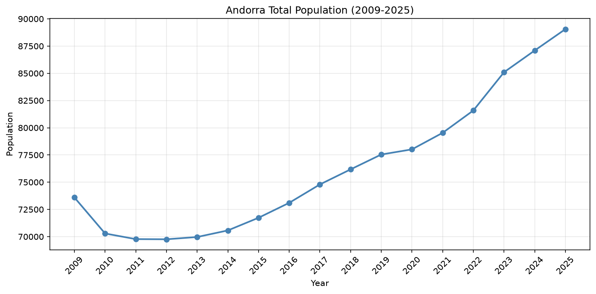
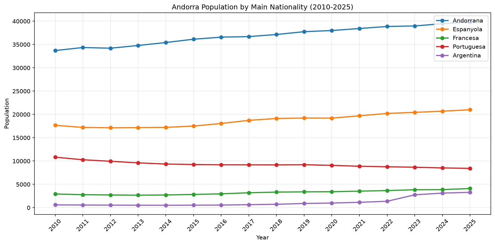
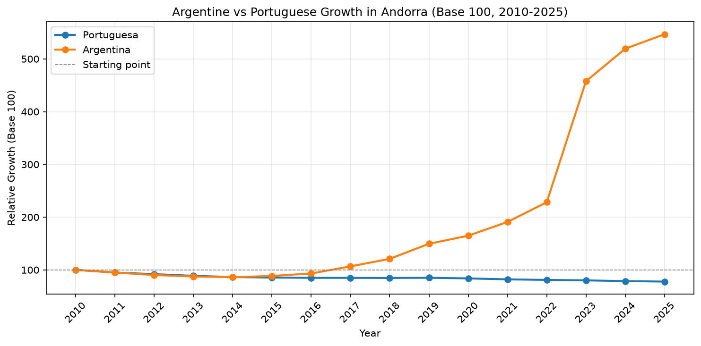
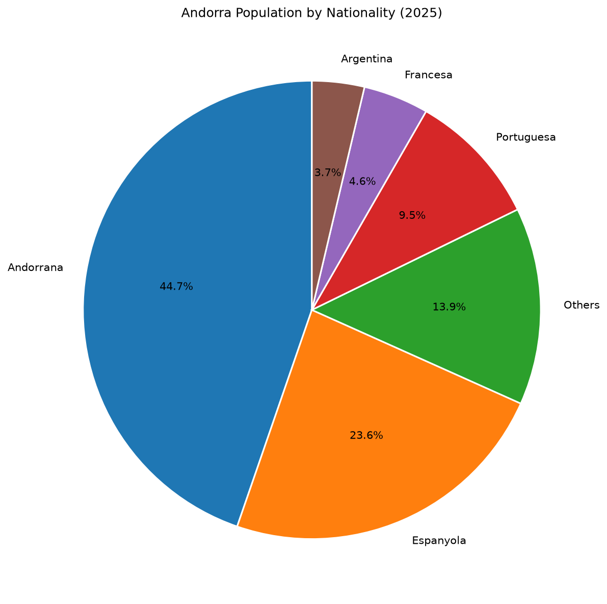
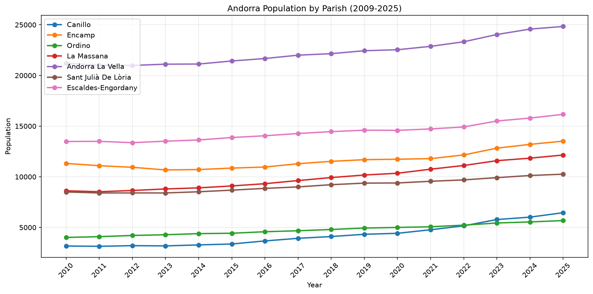
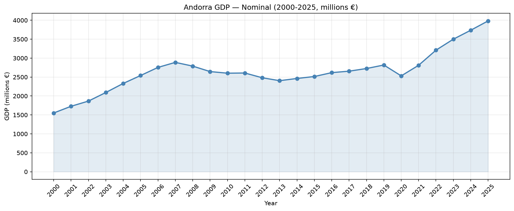
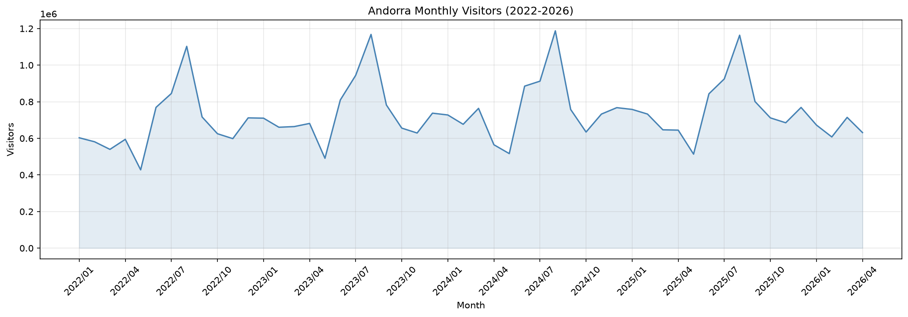
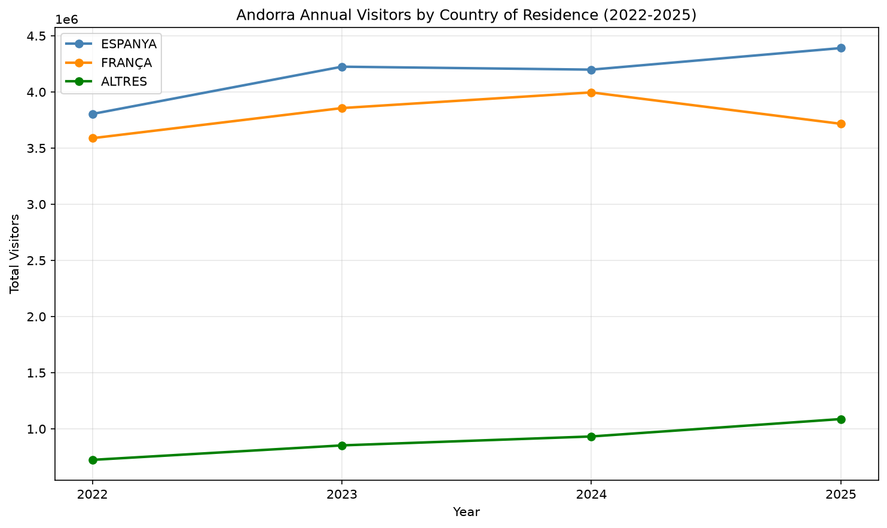
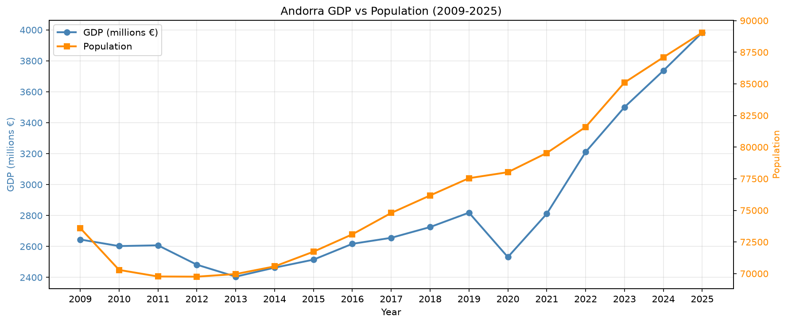

# 🇦🇩 andorra-demographic-analysis

A data analysis project exploring demographic and economic trends in Andorra 
using official statistics from the Departament d'Estadística d'Andorra.


---

## 🔍 Key Findings

### Demographics
- **Andorrans are a minority in their own country** — only 44.7% of residents hold Andorran nationality
- **Population grew 27%** between 2011 and 2025, from 69,772 to 89,058 inhabitants
- **Portuguese community declining** — down 22% since 2010
- **Argentine community exploded** — grew 547% since 2010, accelerating sharply after 2022
- **Canillo is the fastest growing parish** — nearly doubled its population since 2009

### Economy
- **GDP grew 157% in 25 years** — from €1.55B (2000) to €3.98B (2025), historic high
- **15-year stagnation after 2008 crisis** — pre-crisis GDP peak not recovered until 2022
- **Dual-season tourism economy** — summer shopping + winter ski at Grandvalira
- **Spain and France account for 85%+ of visitors** — driven by geographical position

---

## 📊 Visualizations

### Demographics Notebook

**Total Population Evolution (2009-2025)**


**Population by Nationality (2010-2025)**


**Argentine vs Portuguese Growth (Base 100)**


**Nationality Distribution in 2025**


**Population by Parish (2009-2025)**


### Economy Notebook

**GDP Evolution (2000-2025)**


**Monthly Visitor Seasonality (2022-2026)**


**Annual Visitors by Country (2022-2025)**


**GDP vs Population (2009-2025)**


---

## 📓 Notebooks

- [`analysis_demographics.ipynb`](analysis_demographics.ipynb) — Population structure, nationality composition, parish distribution
- [`analysis_economy.ipynb`](analysis_economy.ipynb) — GDP evolution, tourism patterns, economic-demographic correlation

---

## 📁 Project Structure
andorra-demographic-analysis/

├── analysis_demographics.ipynb   # Demographics analysis

├── analysis_economy.ipynb        # Economic analysis

├── data/                         # Raw CSV files from estadistica.ad

├── output/                       # Generated charts

└── README.md
---

## 🗃️ Data Sources

All data from **Departament d'Estadística d'Andorra**:
- [estadistica.ad](https://www.estadistica.ad)
- Population: series 010101010001, 010101010007, 010101010002
- GDP: series 020101070001, 020101070007
- Tourism: series 020506080001, 020506080003

---

## ⚙️ Installation

```bash
git clone https://github.com/david-deluca/andorra-demographic-analysis.git
cd andorra-demographic-analysis
pip install jupyter pandas matplotlib seaborn
jupyter notebook
```

---

## 📄 License

MIT License — see [LICENSE](LICENSE) for details.